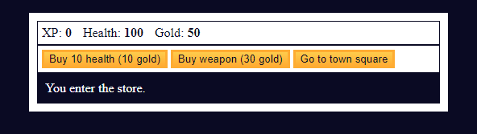
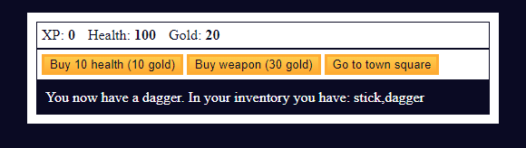
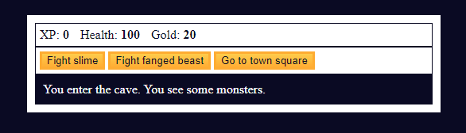
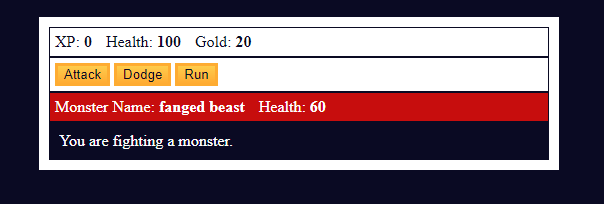
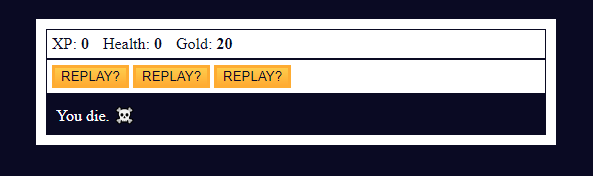

# Role-playing Game

## Description

A simple text-based RPG (Role-Playing Game) using HTML and JavaScript. The game involves navigating through different locations, making decisions, fighting monsters, buying/selling weapons, and engaging in special events.

## Game Flow

* **Initialization:** The game starts in the town square.

* **Player Choices:** Players make choices by clicking buttons to go to the store, cave, or fight a dragon.

* **Store and Inventory:** Players can buy health, buy weapons, and sell weapons in the store. The inventory is updated accordingly.

* **Cave and Combat:** Players can fight different monsters in the cave. Combat involves attacking, dodging, and handling outcomes like defeating monsters or losing the game.

* **Special Events:** The game includes special events like an Easter egg game.

* **Win/Lose Conditions:** The game has win and lose conditions, leading to different outcomes and a chance to restart.

This code provides a foundation for a text-based RPG game with various locations, combat mechanics, and events. Players progress through the game by making choices and experiencing different outcomes.

https://eesahbella.github.io/role-playing-game/

## References

* https://www.freecodecamp.org/learn/javascript-algorithms-and-data-structures-v8/#learn-basic-javascript-by-building-a-role-playing-game
